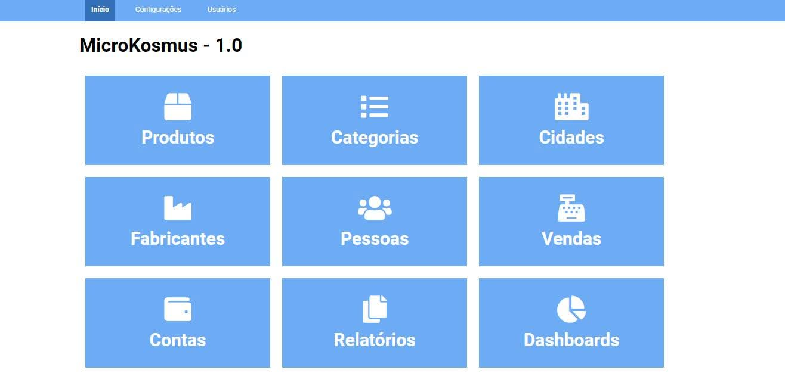

# Sistema de Gestão PHP



## Descrição 

Este é um sistema de gestão desenvolvido em PHP e MySQL, utilizando uma estrutura MVC própria. 

## Funcionalidades

- **Cadastro de usuários**: Permite o registro de novos usuários no sistema.
- **Autenticação de usuários**: Sistema de login para acesso seguro.
- **Gerenciamento de estoque**: Controle de produtos, entradas e saídas.
- **Interface administrativa**: Painel para visualização e gerenciamento de dados.


## Tecnologias Utilizadas

- **Backend**: PHP
- **Banco de Dados**: MySQL
- **Estrutura**: MVC (Model-View-Controller)

## Como Rodar o Projeto

- Servidor Apache ou Nginx
- PHP 7.4 ou superior
- MySQL 

### Passos

1. Clone o repositório:
    ```bash
    git clone https://github.com/gustavoalvesdev/sistema-gestao-php.git
    ```

2. Configure o banco de dados: 
    - Importe o arquivo `estoque.sql` para criar as tabelas necessárias.

3. Ajuste as configurações: 
    - Edite o arquivo `config.php` com as credenciais do seu banco de dados.

4. Acesse o sistema:
    - Abra o navegador e vá para `https://localhost/sistema-gestao-php`.

## Contribuições 

Contribuições são bem-vindas! Para sugerir melhorias ou corrigir problemas, siga os passos abaixo:

1. Faça um fork deste repositório.
2. Crie uma nova branch para sua feature de correção:
    ```bash
    git checkout -b minha-nova-feature
    ```
3. Faça suas alterações e commit:
    ```bash
    git commit -m "feat: adiciona nova feature"
    ```
4. Envie para o seu repositório remoto
    ```bash
    git push origin minha-nova-feature
    ```
5. Abra um Pull Request neste repositório.

## Licença

Este projeto está licenciado sob a licença MIT - veja o arquivo [LICENSE](LICENSE) para mais detalhes.